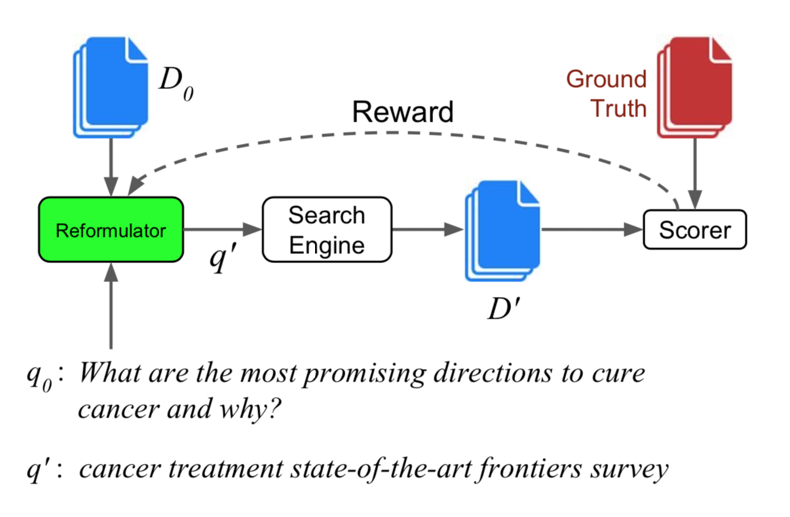
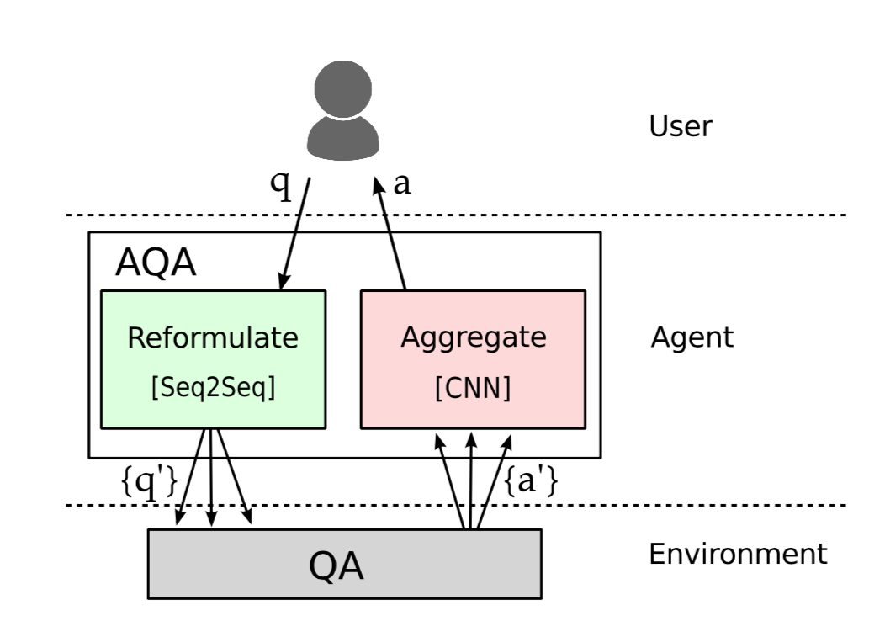

# RLQA

### Motivation

Query expansion/reformulation based QA: Given a question, search it in a search engine like lucene, calculate recall, and use it as a reward to learn a reformulator. Furthermore, use the retrieved snippet to do reading comprehension to find the answer span, and use the final performance as a reward to the reformulator.

### Models
1. Query reformulation with RL

2. Ask the right questions

### Reinforcement Learning Framework
- State: current words in the query
- Action: select a word to expand the query
- Reward: recall@K

### References
1. Buck, C., Bulian, J., Ciaramita, M., Gajewski, W., Gesmundo, A., Houlsby, N., & Wang, W. (2017). Ask the right questions: Active question reformulation with reinforcement learning. arXiv preprint arXiv:1705.07830.

2. Nogueira, R., & Cho, K. (2017). Task-oriented query reformulation with reinforcement learning. arXiv preprint arXiv:1704.04572.
